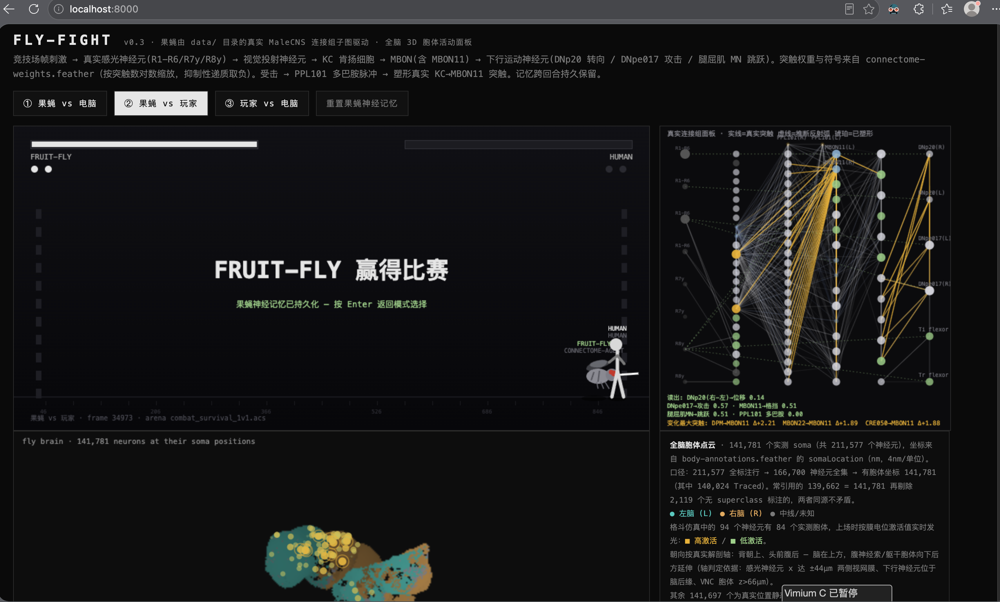

# FLY-FIGHT — 果蝇连接组格斗竞技场

[English version: README-en.md](README-en.md)

一只由**真实果蝇连接组**驱动的格斗角色。灵感来自 [nftechie/doomfly](https://github.com/nftechie/doomfly)：
不是脚本 AI，而是把 MaleCNS 全脑图谱的一个真实子图（94 神经元 / 621 突触）当作"大脑"接进游戏，
逐帧接收竞技场刺激、产生动作，并用多巴胺门控可塑性在学习回合间留下持久记忆。



## 三种模式

| 模式 | 说明 |
|---|---|
| ① 果蝇 vs 电脑 | 连接组果蝇对战脚本 bot |
| ② 果蝇 vs 玩家 | 你对战果蝇（果蝇会挨打学习、进化） |
| ③ 玩家 vs 电脑 | 纯格斗，无神经仿真 |

三局两胜。含格挡、破防、硬直、击退、跳跃（空格）等机制。

## 操作

- 玩家 1（左）：`A` `D` 移动 · `空格` 跳跃 · `J` 攻击 · `K` 格挡
- 玩家 2（右）：`←` `→` 移动 · `↑` 跳跃 · `.` 攻击 · `,` 格挡
- 单人模式（②③）两套键位通用 · `Enter` 开始 / 返回菜单

## 神经数据管线（全部来自 `data/` 的真实 MaleCNS 文件，不虚构）

```
data/annotations.feather      211,577 个神经元标注（含 somaLocation 胞体坐标）
data/transmitters.feather 递质共识（gaba/glycine → 突触取负号）
data/weights.feather    151,856,684 条真实突触边
        │
        ├─ tools/extract_brain.py  → brain-data.js  94 神经元子图 + 621 突触（权重按突触数对数缩放）
        └─ tools/extract_soma.py   → soma-data.js   141,781 个实测胞体 3D 点云（uint16+base64，1.32MB）
```

仿真回路：竞技场帧刺激 → 真实感光神经元(R1-R6/R7y/R8y) → 视觉投射神经元 → KC 肯扬细胞 →
MBON(含 MBON11 格挡读出) → 下行运动神经元(DNp20 转向 / DNpe017 攻击 / 腿屈肌 MN 跳跃)。
受击 → PPL101 多巴胺脉冲 → 厌恶门控塑形真实 KC→MBON11 与运动读出突触；命中 → 奖励脉冲。
记忆写入 localStorage（`fly_fight_brain_v2_*`），跨回合、跨刷新持久保留。

## 面板

- **真实连接组面板**（右上）：94 神经元激活热图，实线=真实突触、虚线=推断反射弧、橙=已塑形。
- **全脑 3D 胞体面板**（下）：141,781 个实测胞体按真实坐标渲染，左脑青 / 右脑橙，
  拖拽旋转、滚轮缩放；仿真中的 84 个有胞体的神经元按膜电位激活值实时发光。
  坐标系（实测判定）：x=左右，y=背腹（腹为正），z=前后（后为正）。
  口径：211,577 全标注 → 166,700 神经元全集 → 有胞体坐标 141,781（外部常引用的 139,662 为再剔除
  2,119 个无 superclass 标注者）。

## 运行

```bash
python3 tools/get_malecns.py     # 下载大脑数据
python3 tools/extract_brain.py   # 需要 pyarrow + pandas（首次生成 brain-data.js）
python3 tools/extract_soma.py    # 首次生成 soma-data.js
# 然后直接用浏览器打开 index.html 

# 或者启一个 http 服务器：
python3 -m http.server 8888
# 浏览器访问 http://localhost:8888
```

## 说明

突触连接与权重来自真实数据；但感觉映射（竞技场→感光神经元）与动作读出（DNp20→转向等）
是工程指派，属于推断代理，与 doomfly 原项目一样不构成"学会格斗"的科学证据。
可塑性作用于真实 KC→MBON11 等突触、可观察到适应行为，但解释需谨慎。
本项目与 id Software、ZenMax 及 nftechie 无关联。
